# Battleship-Game

Battleship is a guessing game where the player has to find the location of a certain number of ships marked on a grid. The players has a certain number of bullets to correctly guess all the locations of the ship on the grid or else they lose.

[View live project here.](https://ubattleship-game-8145696e70f4.herokuapp.com/)

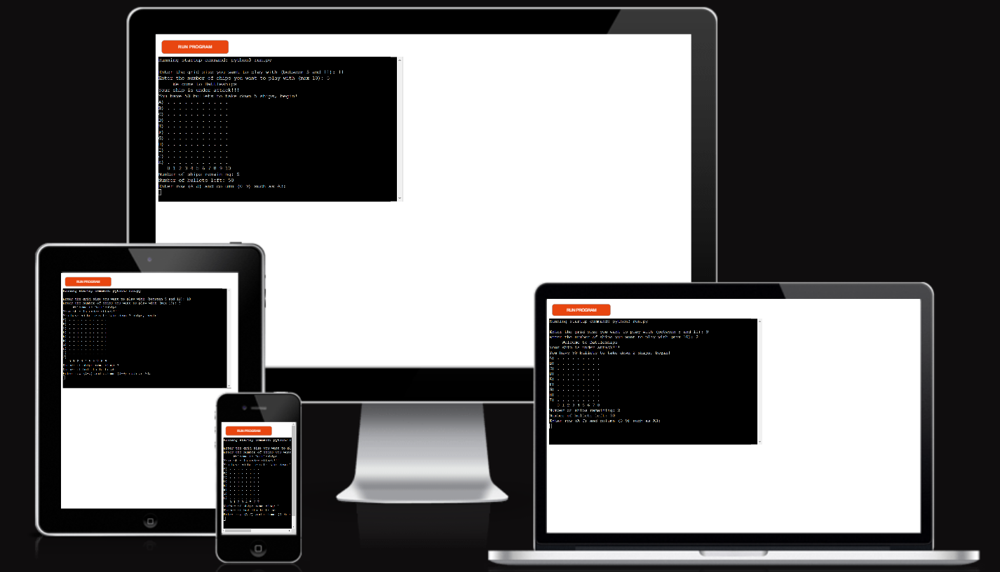

## How To Play
- The game will ask the user to create a grid size and how many ships would be on the grid.

- The user then has to find all the ships 
on the grid before they run out of bullets or they fail.

- To find the ships the user has to guess the location of each section of the ship.

- For a ship to be fully destroyed all the sections of the ship has to be found.

- Once all ships are fully destroyed the user wins the game

## Features
This game has three features:

 -The first one being the selction area
 
 -The second being the game area.

 -And last being the win or lose area.

- Selection area

  -The user in this are must decide the grid size and number of ships in the grid.

  -The grid must be between 5 and 11.

  The ship number must be less than 10.

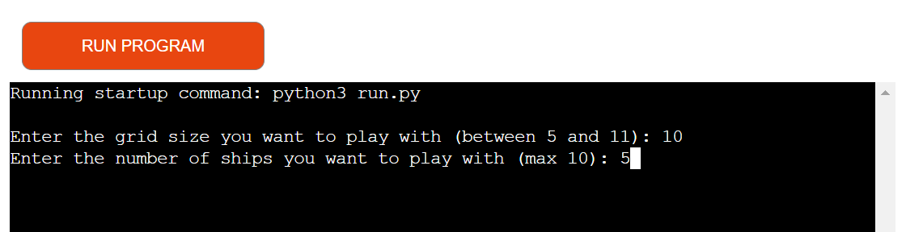

- Game area

  -This is where the grid and ships are loaded.

  -The grid is labeled from 1-10 on the x-axis and A-J on the y-axis depending on your grid size.

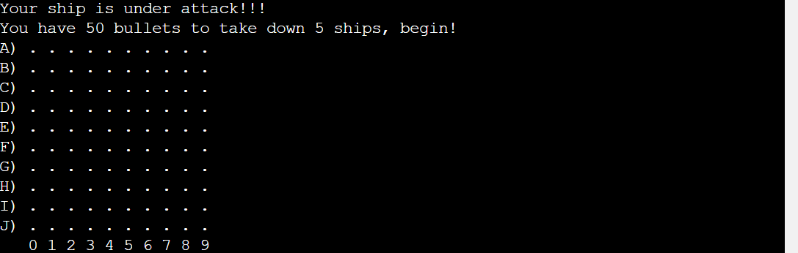

- Finish area

  - This part come on when the user either:

    - Finds all the ships on the grid.

    - Runs out of bullets.

  - If the user runs out of bullets they have failed the game and this text will appear.

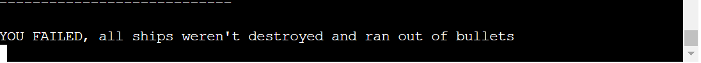
    
 - If the user find all the ships before they run out of bullets it means they won and this text appears

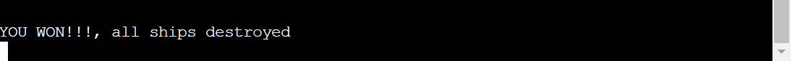

## Data Model

This game consists of eight global variables and nine functions. 

Functions:

  1. validate_ship

  2. help_place_ship

  3. create_grid

  4. print_grid

  5. bullet_placement

  6. ship_sunk

  7. shot

  8. game_done

  9. main

Variabels:

  - grid

  - grid_size

  - ships 

  - bullets

  - game_over

  - sunk

  - ship_position

  - letters

## Flowchart

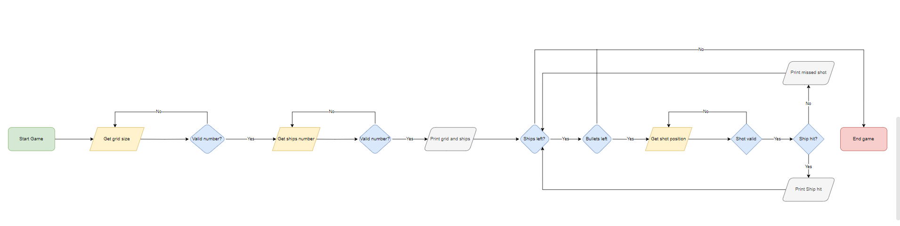

## Testing

- Ran the game with different grid sizes to see how the ships would look on the grid.

- Ran the game with different ship numbers to see how they would look on the grid.

|What was tested|Result|
|---|---|
|Load game|Passed|
|Get grid size|Passed|
|Grid size error|Passed|
|Get ship numbers|Passed|
|Ship number error|Passed|
|Load grid|Passed|
|Load ships|Passed|
|Valid bullet placement|Passed|
|Invalid bullet placement errors|Passed|
|Ship sink|Passed|
|Game won|Passed|
|Game lost|Passed|  
|Close game|Passed|

|Action|Results|
|---|---|
|Invalid grid size 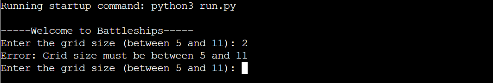|Error message|
|Invalid ship number 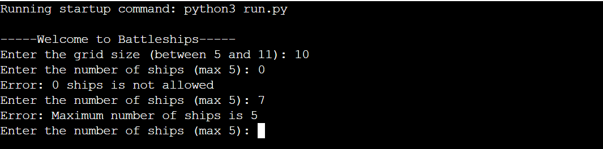|Error message|
|Grid size and ships appear 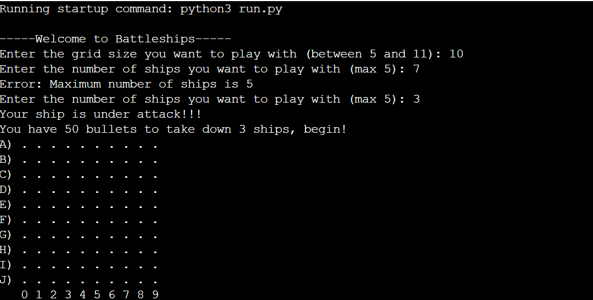|Correct grid size appears with ships invisible|
|Invalid bullet placement (wrong order eg. 2A) 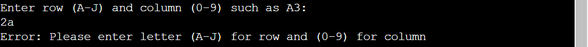|Error message|
|Invalid shot (letters not on grid eg. X2) 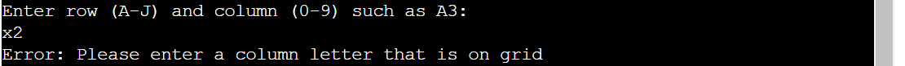|Error Message|
|Invalid bullet placement(Number not on gird eg. D10)|Error Message|No Error Message appears|
|Valid bullet placement (Miss) 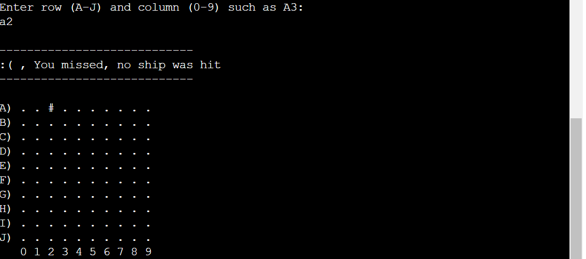|"#" appears with text stating that shot was missed|
|Valid shot (hit) 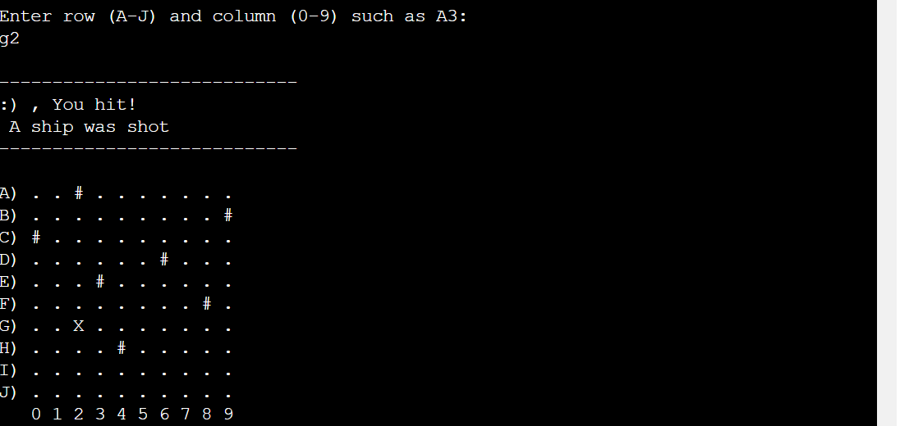|"X" appears with text stating ship was hit|
|Already selected area 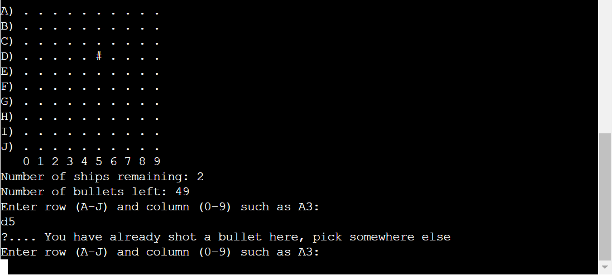|Message stating that area was already picked|
|Ship destroyed 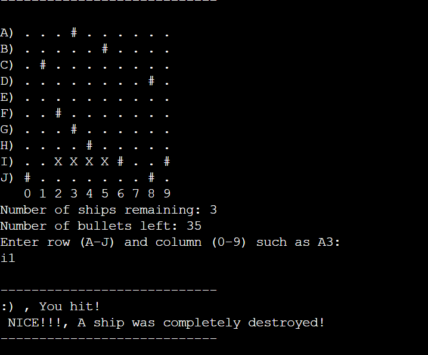|Message stating destroyed ship|
|Game over (Lost) 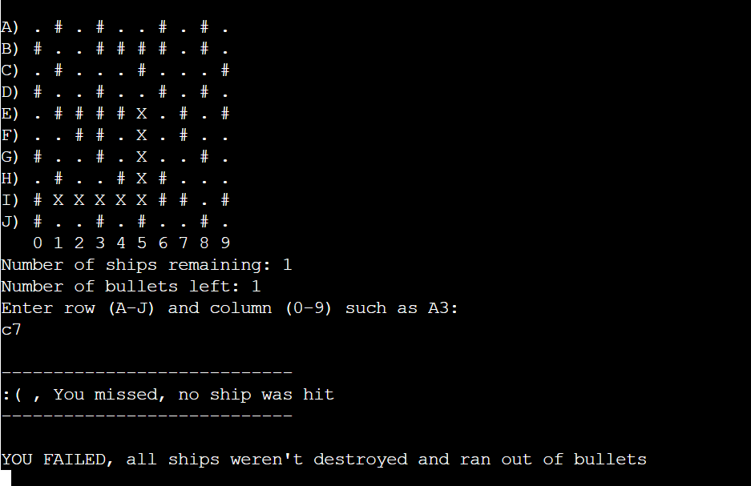|Message stating that you failed|
|Game over (Won) 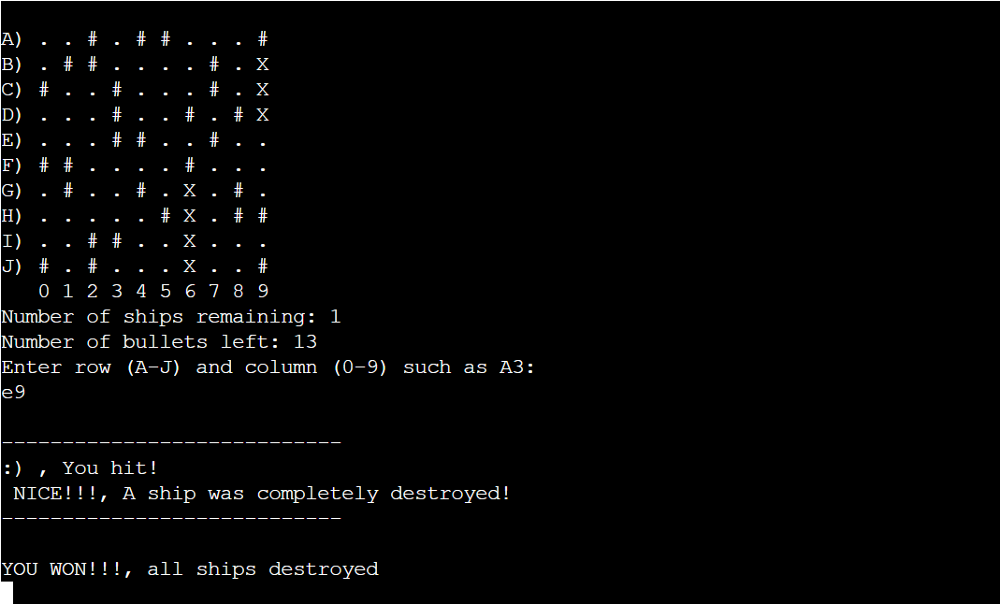|Message stating that you won|

### Validator Testing

- Pyhton

  - The code was also ran through the [Code Institute Python Linter](https://pep8ci.herokuapp.com/#) and it also showed no errors.

- Accessibility

  - This was ran through lighthouse and the results are are:

  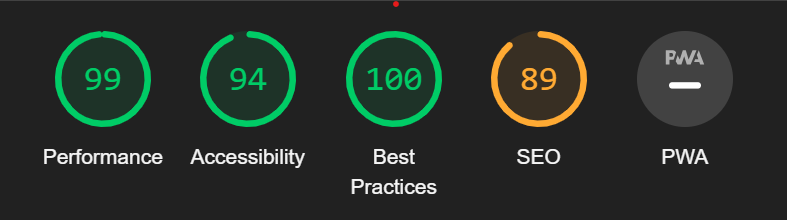

## Bugs

### Solved Bugs

#### Ship Numbers and Grid Size

- One problem I had while I was creating this code was figuring out how to allow the user to pick their own gird size and the number of ships they wanted to deploy.

- At first I tried to add the input function to get the numbers into the global variables of "ships" and "grid_size" but this didn't work as it wasn't getting read by any of the functions.

- This was solved by adding the "ships" and "grid_size" global variables into the "main" function and having it get the numbers from their.

#### Game Crash Due To User Input

- Another problem I had was that the game crashes when user only fills one placement e.g. instead of put "J9" they put "9" or "J".

- The solution was to check if the length of the submission was equal to two and if not print an error and actually allow the user to try again.

## Deployment

- This site was deployed on the Heroku app. The steps to deploy are as follows:

  1. Create an account on [Heroku](https://dashboard.heroku.com/apps).

  2. In the Heroku Dashboard click create a new app.

  3. Type in the app name (ubattleship-game) and select region (Europe)

  4. Once done go to settings and click reveal config vars.

  5. inside config vars add the word "PORT" to key with a value of 8000.

  6. Then go to add buildpacks in settings and click python then nodejs (python must be above nodejs).

  7. Then go to deploy and click on the Github deploy method.

  8. Then connect you app to your repository.

  9. Finally click on the deploy branch on the manual deploy section at the bottom of the page.

[View live project here.](https://ubattleship-game-8145696e70f4.herokuapp.com/)

## Credits 

### Content

- The video that helped me create this battleship game was found on Youtube by [Cs Students](https://www.youtube.com/watch?v=MgJBgnsDcF0&t).

### Media

- The flowchart was created using [Draw.io](https://app.diagrams.net/)
