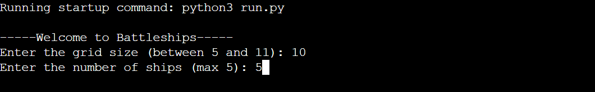

# Battleship-Game

Battleship is a guessing game where the player has to find the location of a certain number of ships marked on a grid. The players has a certain number of bullets to correctly guess all the locations of the ship on the grid or else they lose.

[View live project here.](https://ubattleship-game-8145696e70f4.herokuapp.com/)

## Features
This game has three features:

 -The first one being the selction area
 
 -The second being the game area.

 -And last being the win or lose area.

- Selection area

  -The user in this are must decide the grid size and number of ships in the grid.

  -The grid must be between 5 and 11.

  The ship number must be less than 10.

- Game area

  -This is where the grid and ships are loaded.

  -The grid is labeled from 1-10 on the x-axis and A-J on the y-axis depending on your grid size.

- Finish area

  - This part come on when the user either:

    - Finds all the ships on the grid.

    - Runs out of bullets.

  - If the user runs out of bullets they have failed the game and this text will appear.

    
 - If the user find all the ships before they run out of bullets it means they won and this text appears

## Data Model

This game consists of eight global variables and nine functions. 

Functions:

  1. validate_ship

  2. help_place_ship

  3. create_grid

  4. print_grid

  5. bullet_placement

  6. ship_sunk

  7. shot

  8. game_done

  9. main

Variabels:

  - grid

  - grid_size

  - ships 

  - bullets

  - game_over

  - sunk

  - ship_position

  - letters

## Testing
- The code was ran through a [synk.io](https://snyk.io/code-checker/python/) python validator and no errors were found.

- Ran the game with different grid sizes to see how the ships would look on the grid.

- Ran the game with different ship numbers to see how they would look on the grid.

|What was tested|Result|
|---|---|
|Load game|Passed|
|Get grid size|Passed|
|Get ship numbers|Passed|
|Load grid|Passed|
|Load ships|Passed|
|Valid bullet placement|Passed|
|Invalid bullet placement errors|Passed|
|Ship sink|Passed|
|Game won|Passed|
|Game lost|Passed|  
|Close game|Passed|

|Action|Expected results|
|---|---|
|Invalid grid size |Error message|
|Invalid ship number |Error message|
|Grid size and ships appear |Correct grid size appears with ships invisible|
|Invalid bullet placement (wrong order eg. 2A) |Error message|
|Invalid shot (letters not on grid eg. X2) |Error Message|
|Invalid bullet placement(Number not on gird eg. D10)|Error Message|No Error Message appears|
|Valid bullet placement (Miss) |"#" appears with text stating that shot was missed|
|Valid shot (hit) |"X" appears with text stating ship was hit|

## Bugs